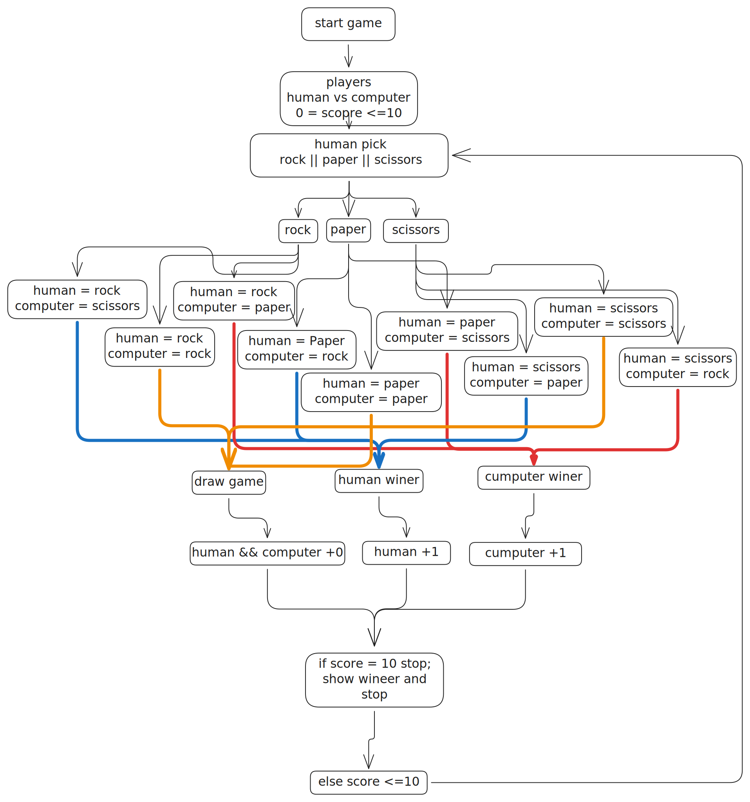

# Rock, Paper, Scissors (Console Game)

> A classic "Rock, Paper, Scissors" game running directly in the browser console, built with pure JavaScript logic.

## 1.0 💻 About the Project

This project implements the core logic of the Rock, Paper, Scissors game. The main goal was to practice algorithm development, data manipulation, and control flow without relying on a complex graphical interface (DOM), focusing purely on the back-end logic simulated within the console.

The game runs a "Best of 5" match between the User and the Computer.

## 2.0 Features

-   **2.1 Prompt Interaction:** Collects user input directly through the browser.
-   **2.2 Random Intelligence:** The computer makes unpredictable moves using `Math.random()`.
-   **2.3 Case Insensitive:** Accepts inputs in any format, such as "rock", "ROCK", or "RoCk".
-   **2.4 Scoring System:** Tracks and updates the score round by round.
-   **2.5 Game Loop:** Automatically executes 5 rounds using loops.
-   **2.6 Winner Validation:** Robust conditional logic to determine wins, losses, and draws.

## 3.0 Tech Stack

-   **3.1 HTML5:** Basic structure to load the script.
-   **3.2 JavaScript (ES6+):**
    -   `let` & `const`
    -   `Arrow Functions` & `Function Expressions`
    -   `Loops` (For)
    -   `Conditionals` (If/Else)

## 4.0 Architecture & Logic

The game flow was designed to be modular and easy to understand. Below is the logical diagram of the game's operation:



> *Note: The editable source file for this diagram is available at `docs/diagram.excalidraw`.*

## 5.0 How to Run

Since this project runs in the browser console, follow these steps:

1.  **Clone the repository:**
    ```bash
    git clone [https://github.com/YOUR-USERNAME/rock-paper-scissors.git](https://github.com/YOUR-USERNAME/rock-paper-scissors.git)
    ```
2.  **Open the file:**
    Navigate to the project folder and open `index.html` in your browser (Chrome, Firefox, etc.).
3.  **Open the Console:**
    -   Right-click anywhere on the page -> **Inspect**.
    -   Go to the **Console** tab.
    -   *Or press `F12`.*
4.  **Play:**
    Answer the prompts that appear on the screen and watch the results in the console.

## 6.0 Key Learnings

During the development of this project, I practiced essential concepts:
-   How to break down a large problem into small helper functions (`getComputerChoice`, `playRound`, `playGame`).
-   Using `Math.floor` and `Math.random` to generate random choices.
-   Understanding the difference between global and local variable scope.
-   Git best practices and Semantic Commits.

---